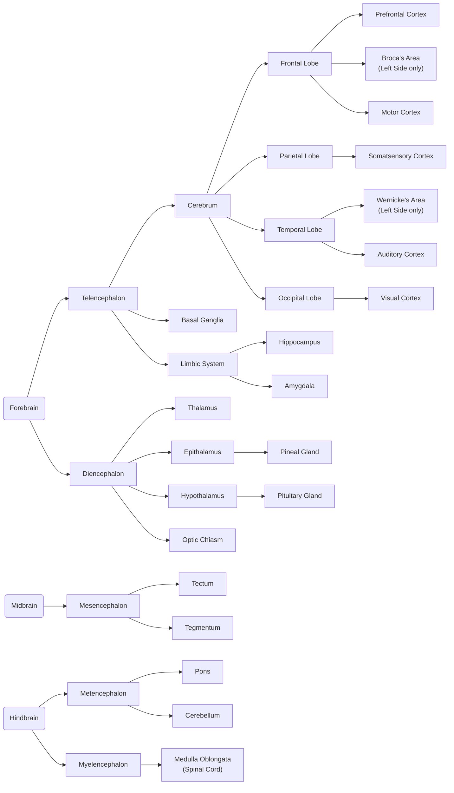
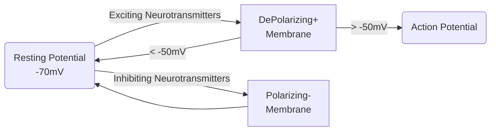
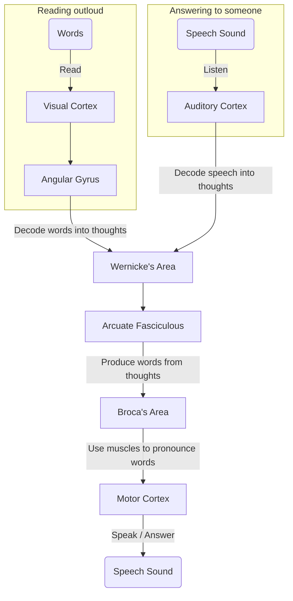
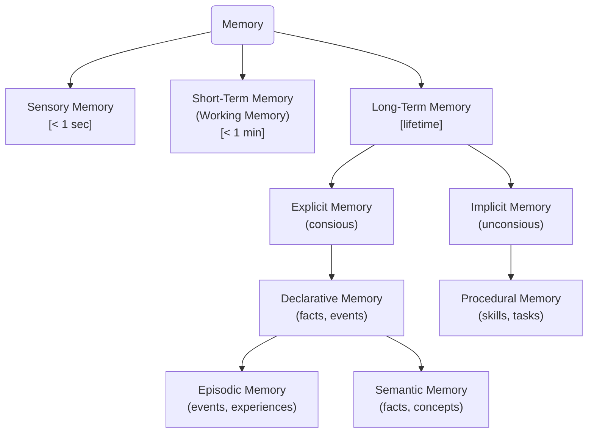

# Notes on Neuropsychology 101

## Disclaimers

* The [*Professor Dave Explains* Youtube playlists of "Biopsychology"](https://www.youtube.com/playlist?list=PLybg94GvOJ9EQp4lGx2kxTvA4Y7HUo5VY) and ["Anatomy and Physiology"](https://www.youtube.com/playlist?list=PLybg94GvOJ9HVbNobTmFnOxXRn1dIpffc), as well as the [*MIT Lectures of Nancy Kanweiser*](https://www.youtube.com/playlist?list=PLUl4u3cNGP60IKRN_pFptIBxeiMc0MCJP) have proven to be immensely useful resources for these notes.

## Anatomy of the Brain

### Brain structures and their functions

| Name                 | Functions                                                                                                                                                             | Brain Atlas                                                                     |
| -------------------- | --------------------------------------------------------------------------------------------------------------------------------------------------------------------- | ------------------------------------------------------------------------------- |
| Prefrontal Cortex    | Executive Functions:  - Working Memory  - Attention  - Decision Making  - Problem Solving  - Behaviour Inhibition  - Reasoning  - Empathy | [click](https://neurotorium.org/tool/brain-atlas/#prefrontal-cortex)            |
| Broca's Area         | Language Generation                                                                                                                                                   | [click](https://neurotorium.org/tool/brain-atlas/#broca%E2%80%99s-area)         |
| Motor Cortex         | Responsible for movement generation                                                                                                                                   | [click](https://neurotorium.org/tool/brain-atlas/#primary-motor-cortex)         |
| Somatosensory Cortex | Processes sensations - Sensation of touch - Haptic Feedback - Temperature  - Balance  - Pain                                                  | [click](https://neurotorium.org/tool/brain-atlas/#primary-somatosensory-cortex) |
| Auditory Cortex      | Accepts and encodes sound                                                                                                                                             | [click](https://neurotorium.org/tool/brain-atlas/#primary-auditory-cortex)      |
| Wernicke's Area      | Makes sense of language                                                                                                                                               | [click](https://neurotorium.org/tool/brain-atlas/#wernicke%E2%80%99s-area)      |
| Visual Cortex        | Accepts and encodes visual information                                                                                                                                | [click](https://neurotorium.org/tool/brain-atlas/#primary-visual-cortex)        |
| Hippocampus          | Plays a huge role in memory and spatial associations                                                                                                                  | [click](https://neurotorium.org/tool/brain-atlas/#hippocampus)                  |
| Amygdala             | Center of fear and "*Fight or Flight*" response                                                                                                                       | [click](https://neurotorium.org/tool/brain-atlas/#amygdala)                     |
| Pineal Gland         | Generates hormone melatonin, regulates sleep-cycle                                                                                                                    | [click](https://neurotorium.org/tool/brain-atlas/#pineal-gland)                 |
| Pituitary Gland      | Generates hormones for reflexes, sexual desire, digestion, "*Fight or Flight*"                                                                                        | [click](https://neurotorium.org/tool/brain-atlas/#pituitary-gland)              |
| Thalamus             | Dispatches information between the different parts of the brain                                                                                                       | [click](https://neurotorium.org/tool/brain-atlas/#thalamus)                     |
| Tectum               | Reflexes in response to auditory or visual stimuli                                                                                                                    |                                                                                 |
| Tegmentum            | Homeostasis, plays a role in pain relief                                                                                                                              |                                                                                 |
| Pons                 | - Passes messages from the Forebrain to Cerebellum - Plays a role in respiration                                                                              | [click](https://neurotorium.org/tool/brain-atlas/#pons)                         |
| Cerebellum           | - Balance - Body Posture - Motor coordination - Memory                                                                                                    | [click](https://neurotorium.org/tool/brain-atlas/#cerebellum)                   |
| Medulla Oblongata    | It is the last part of the brain before the Spinal Cord                                                                                                               | [click](https://neurotorium.org/tool/brain-atlas/#medulla-oblongata)            |

### Hemispheres, Lateralization and the *Corpus Callosum*

The brain, from Diencephalon and moving towards the Telencephalon, is organized in **2 Hemispheres**. The 2 Hemispheres are closely identical. This means that many brain parts exist in double, one residing in the Left Hemisphere (LH) and one in the Right (RH). Parts like the Amygdala, Hippocampus (of the Diencephalon), as well as the Cerebrum lobes (Frontal, Parietal, Temporal and Occipital), exist in double.

The brain functionalities are *lateralized*, meaning they are shared between the Hemispheres. Typically, the *Language Processing is lateralized to the Left Hemisphere*, with Broca's Area (Language Generation, located roughly behind the left eye) and Wernicke's Area (Language Comprehension, located roughly behind the left ear).

Additionally, *Body Control is mostly Laterilized*, with the RH controling the left parts of the body and the LH controling the right parts.

Finally, *Vision is Laterilized through the Optic Chiasm*, which is better explained under [*Visual System*](#visual-system).

The *Corpus Callosum* ([Brain Atlas link](https://neurotorium.org/tool/brain-atlas/#corpus-callosum)) *connects the two Hemispheres*. This enables the cross-functionality of the brain. E.g: Putting in words (LH functionality - Broca's Area) events of symbolic memory (RH functionality - Right Hippocamhpus).

Severing the Corpus Callosum, such as in old cases of Epileppsy, would create the "split-brain" effect, where the two Hemispheres do not communicate.

---

## Neural Firing

### The Neuron

The Neuron or Neural Cell, is the part of the brain that can be individually analyzed to lead us to the big picture. The *Central Nervous System* (CNS) contains more than 80 billion of them.

The Neuron is designed *to transfer information*. All its parts play a role in this functionality:

| Name             | Functionality                                                                                                                                                                                   |
| ---------------- | ----------------------------------------------------------------------------------------------------------------------------------------------------------------------------------------------- |
| Soma (Cell Body) | Contains the Nucleus (DNA, RNA) and the components of the Cell that keep it alive (Mitochondria, etc)                                                                                           |
| Cell Membrane    | It is the part that encloses the neuron, *selectively* isolating it from its surroundings, maintaining the *Resting Potential* and enabling its *Action Potential*.                             |
| Axon             | The long tail connecting the *Dendrites* to the *Axon Terminals*.  *Sometimes* it is surrounded by *Myelin Sheath* and split by *Nodes of Ranvier*.                                         |
| Axon Terminals   | Contain the Pre-Synaptic parts, that hold (and *reuptake*) the *Neurotransmitters* and release them to the *Synaptic clefts*. Serve as the *Output* of the Neuron.                              |
| Dendrites        | Contain the Post-Synaptic parts that receive *Neurotransmitters* through the *Synaptic clefts*. Serve as the *Input* of the Neuron.                                                             |
| Myelin Sheath    | Insulation of the Axon that vastly increases the speed of the travelling information (from the *Dendrites* to the *Axon Terminals*).                                                            |
| Nodes of Ranvier | They are responsible for the [*Saltatory Conduction*](#saltatory-conduction), a process that helps $Na^+$ Ions travel faster during the [*Action Potential*](#action-potential), saving energy. |

### Neuron Potentials

The move from *Resting* to *Action Potential* is what the Neurons are designed to do - their function. It is a chemical and electrical phenomenon, yet a very simple concept.

All moving parts will be explained below omitting as many intimidating details as possible (a more advanced take is available in this *Harvard Extension School* Video: [Action Potential in the Neuron - YouTube](https://www.youtube.com/watch?v=oa6rvUJlg7o) and greatly explained here: https://pressbooks.online.ucf.edu/lumenpsychology/chapter/reading-neural-communication/)

#### The Ions

Ions are the electrically charged counterparts of atoms. The ones we care about are:

| Symbol | Name     |
| ------ | -------- |
| $Na^+$ | Sodium   |
| $K^+$  | Potasium |
| $Ca^+$ | Calcium  |

#### The Electrical Urge

The Ions with different polarities (`+` and `-`) have the urge of coming close to each other. Generally, the *positive* Ions want to move to a more *negatively charged* place (place with more *negative* Ions) and vice-versa.

The more negatively (/positively) charged the place, the more the positive (/negative) Ions want to go there! This urge is measured in Volts ($V$).

#### Chemical Urge

All the Ions feel like moving to places that less of their kind exist. Much like *dye in a water glass will blend* (even without stirring), trying to reach homogeneity. *Homogenous* blends are the ones that if you take a teaspoon from them, it will be the same as any other teaspoon from the  same blend! In other words, $Na^+$ Ions, for example, don't want to be more in one place, and less in another. They want to spread equally.

These 2 *urges* can explain everything about *Action Potential*! And they form the things called *Chemical Gradient* and *Electrical Gradient* (the *google-able* terms).

### The *Resting Potential* of the Neuron

Neurons both *contain* and *are surrounded* by *Ions*. They contain some $K^+$ Ions and some *Proteins that are negatively charged*. By "contain" we mean that these things exist inside the *Cell Membrane*, and they are not allowed to go through it - without special circumstances.

Outside the *Membrane* there are ***a lot of*** $Na^+$ Ions and some $Ca^+$. This creates the following effects:

* There are plenty $Na^+$ Ions outside the *Membrane* and not nearly as many inside of it. This pumps up their *Chemical Urge* to move inside (until they are split equally in both sides).

* The Negative Proteins in the Neuron charge it overally negative, so $Na^+$ Ions want to move in the *Neuron Cell* due to their *Electrical Urge* as well.
  How much they want to move in? About $-70mV$!

So, in the *Resting Potential* of the neuron, a voltage of about $-70mV$ is measured between the two sides of the *Cell Membrane*. And without external events, this is balanced.

#### The Ion Gates

The Neuron Membrane has several kinds of structures that allow Ions to move through. They serve as Gates, conditionally allowing the entrance or exit. Analyzing all of them and their conditions is beyond the scope of the notes.

The most crucial to understand though is the $Na^+$ Gate. This one opens when the voltage difference of the Membrane reaches about $-50mV$. And if these Gates open, they can let the $Na^+$ Ions rush in!

Yet, there is this $20mV$ of difference, between the *Resting Potential* ($-70mV$) and the $Na^+$ Gate opening. This means that something needs to happen to the Neuron. Something that will add some positive charge to it. The word is *Excitation*!

#### Excitation and Inhibition

The Neurons are made to be connected. Their *Dendrites* and *Axon Terminals* are their plugs. The *Dendrites* are the *Inputs* and the *Terminals* are the *Outputs*. These two get connected when getting pretty close to each other. They come so close that what is between them is named a *Cleft*. The *Synaptic Cleft*.

##### Synapses and Neurotransmitters and Receptors

A Synapse is the space between the connected *Axon Terminal* (Output) of one Neuron with a *Dendrite* (Input) of another. The *Axon Terminal* (the *Presynaptic Membrane*) transmits information to the *Dendrite* by releasing substances called *Neurotransmitters*. These are received by the Dendrite (and its *Postsynaptic Membrane*) through some components, called *Receptors*.

The couple of *Neurotransmitter* and *Receptor* can then do one of two things:

* *Excite* the Membrane (charge it more positively)
  
  * Term: *Excitatory Post Synaptic Potential (EPSP)* 
  
  * Depolarize (Bring it closer to $0mV$)

* *Inhibit* the Membrane (charge it more negatively)
  
  * Term: *Inhibitory Post Synaptic Potential (IPSP)*
  
  * Polarize (Bring it even further from $0mV$)

Now, if the *Dendrite* *Receptors* receive enough Neurotransmitters that excite its Membrane for more than $-20mV$ then the Neuron will move from the *Resting Potential* to the *Action Potential*.

### The *Action Potential*

If an exciting *Neurotransmitter* is received in large enough quantity by enough of the Denrites of a Neuron, the Voltage of the Membrane will get higher than $-50mV$ (called the *Threshold*). And this is when the $Na^+$ Gates open in the Membrane! The $Na^+$ Ions flood inside the Neuron raising its Voltage to up to $+50mV$.

The $Na^+$ will rush through the Axon to the Axon Terminals, making that part of the Membrane allow $Ca^+$ Ions in (through some other Ion Gate). This is the signal for the *Axon Terminal* to release its own Neurotransmitters to the Dendrites of the next Neuron.

If they are enough (or if it receives Neurotransmitters by other Neurons connected to its other Dendrites at the same time), the *Action Potential* of the next Neuron will be triggered, cascading the message across!

#### Saltatory Conduction

This is a small hack that makes $Na^+$ Ions travel faster in the Neuron. The *Nodes of Ranvier* that run through the Axon are already full of $Na^+$ Ions! So the ones that flood the Neuron during the Action Potential, do not need to travel all the way through the Axon, just push the ones found in the *Nodes of Ranvier* towards the *Axon Terminal*!

It is like pumping water in a firehose that is already full of water. There is no need for the water to travel from the pump through the whole hose. The pumped water will push the water in the hose directly out and the effect will be close-to-immediate. It's the same but with $Na^+$ Ions instead of water!

### Types of Drugs

#### Agonists

Are the ones that can substitute a Neurotransmitter. Agonists can be received by Receptors, exciting or inhibiting the Neuron, exactly as a Neurotransmitter would do.

#### Antagonists

Are the ones that block the Receptors for specific Neurotransmitters. They get received by the Receptors but they neither excite or inhibit. They just take up space, so the expected Neurotransmitter won't be able to arrive to the Receptor.

#### Reuptake Inhibitors

The Presynaptic Membranes (in the Axon Terminals) sometimes "reuptake" Neurotransmitters released in the Synapse, saving the energy of recreating them, making them ready for the next firing.

This is hindered by Reuptake Inhibitors, leaving the Neurotransmitters longer in the *Synaptic Cleft*, allowing more time for the Receptors to consume them.

---

## Visual System

### Cones and Rods

These are the 2 types of Cells that encode what we see into neural activity. The Cones are responsible for encoding Color and the Rods encode Brightness. There are 3 types of Cones, encoding Red, Green and Blue and 1 type of Rods. They all reside in the *Retina*.

The Rods and Cones produce the signal that eventually gets transmitted to the *Optic Nerves* through the Ganglion Cells.

### The Optic Chiasma

Sight is one of the functions that is handled *contralaterally*. This means that the right side of the eyesight is processed in the LH and vice-versa. The way the Optic Nerves of both eyes are connected to the *Primary Visual Cortex* (in the Occipital Lobes) is shown below: 

### The Dorsal and Ventral Streams

The *Dorsal* and *Ventral Streams* are the ways we make sense of what we see. We make sense both of *What* is what we see and *Where* it is or *How* it moves.

The *Dorsal Stream* is responsible for the *Where* and *How* of what we see, moving from the *Occipital Lobe* towards the *Parietal Lobe*. The Parietal Lobe is where the somatosensory systems are located. This transmission is fast.

The *Ventral Stream* is about *What* we see, the decoding of the objects into symbols and concepts. This transmission goes from the *Occipital Lobe* to the *Temporal Lobes*. The *Temporal Lobes* contain the memories (Limbic System's Hippocambi and Amygdala) as well as *Wernicke's Area* (Left side only). This transmission is slower than the *Dorsal* one.

---

## Language

### The Wernicke-Gerswind Model

This model describes the pathway that language takes in the brain. The brain components that are involved are described below:

| Name                    | Function                                            |
| ----------------------- | --------------------------------------------------- |
| Wernicke's Area         | Makes sense of language                             |
| Broca's Area            | Language Generation                                 |
| Arcuate Fasciculous     | Connects Broca's Area with Wernicke's Area          |
| Angular Gyrus           | Connects Primary Visual Cortex with Wernicke's Area |
| Primary Visual Cortex   | Accepts and encodes visual information              |
| Primary Motor Cortex    | Responsible for movement generation                 |
| Primary Auditory Cortex | Accepts and encodes sound                           |

The locations of all the components is in the Left Hemisphere, as shown here (the *Arcuate Fasciculous* in shown as an arrow between the 2 Language Areas):

The model suggests the following pathways of language in the cases of:

* Answering to someone (in a conversation)
* Reading Outloud

A big part of both pathways is the same, as shown in the flowchart below:

### Aphasias

Aphasia is the inability to produce coherent language. It is generally caused by damage to brain areas controlling language. Two types of aphasia are described in these notes.

#### Broca's Aphasia - Expressive

In this type of Aphasia there is a fracture between the thoughts and the expression of them through language. It is commonly caused by damage in Broca's Area, which is responsible for encoding thoughts into language.

A patient of Expressive Aphasia *can fully comprehend language*, can think, but is *unable to find the words to express thoughts*, both verbally and through writing.

#### Wernicke's Aphasia - Receptive/Fluent

In this type of Aphasia the comprehension of language is mainly impacted, possibly by damage in Wernicke's Area, which is responsible for understanding language (either written or spoken).

In this case, a patient can produce language (hence *fluent* aphasia), but is mostly incoherent, making communication impossible. It is notable that a patient can very well be **not aware of the problem**, meaning that they cannot understand that their communication does not make sense.

---

## Memory

Memory is split in different types, given its usage and where in the brain they could be located.

### Brain Regions and Memory

Turns out there is *no brain region that single-handedly stores memories* (like a hard drive). *Karl Lashley's* research focused on finding that brain region, he called *Memory Engram*, and *failed*. He concluded that all regions play a role in memory (*equipotentiality*) and that they have equally significant role (mass action).

Memory is held by several regions as well as the communication between them. Some brain regions and the corresponding Memory types are shown below:

| Memory Type                 | Brain Regions                    |
| --------------------------- | -------------------------------- |
| Short-Term Memory           | Prefrontal Cortex                |
| Procedural Memory           | - Basal Ganglia - Cerebellum |
| Declarative                 | Hippocampi                       |
| Sensory (Visual) Memory     | Parietal Lobe                    |
| Episodic (Emotional) Memory | Amygdala                         |

### Hippocampi and H.M.

*Henry Molaison* (H.M.) was admitted to surgery because of his severe epileptic seizures. Both his *Hippocampi* (among other parts, such as *Amygdalas*) were removed in an attempt to cure his life-threatening epilepsy.

After the surgery, H.M. could not form any new *explicit* memories, resulting in a case of *Anterograde Amnesia*. Additionally he could not remember a lot of his recent years, resulting in partial *Retrograde Amnesia* as well.

It is also notable that H.M. could learn new skills, like *Mirror Drawing*, highlighting that *Procedural Memory* is not tightly coupled with the *Hippocampus* and *Amygdala*.

#### Hippocampi and Spatial Memory

The Hippocampi play a significant role in memory. They are responsible for navigating in space and remembering maps and directions. The famous study by Maguire et al (2000), showed that Cab Drivers in London have significantly bigger Hippocampi than non Cab Drivers, as they have to learn by heart the vast map of London.

### Memory and the Neurons

*Donald Hebb*'s research was about *How* (and not *Where* - like Lashley's) memory is stored in the neurons. He found out that a set of neurons form a *Memory Trace* when *they fire together*. He figured that the neural circuits that fire together for enough time, eventually undergo structural changes, connecting to each other - *wiring together*.

This led to the famous phrase "*Neurons that fire together, wire together*" and seems to be a way that memories are formed.

#### Long Term Potentiation (LTP)

The Synapses that are continuously firing tend to "get better at it". This means that both the *Presynaptic Membrane* (*Axon Terminal* of the Output Neuron) tend to send more *Neurotransmitters* and that the *Postsynaptic Membrane* (*Dendrite* of the Input Neuron) creates more *Receptors*.

Eventually, the Input Neuron can get to the Firing Threshold with *less excitation* than initially, as it can receive more Neurotransmitters in one go.

---

## Brain-Imaging

### Types

Brain-Imaging can be of two types:

#### Structural

This type *depicts* the brain. *Magnetic Resonance Imaging* (MRI) is very famous in this category. It takes "photos" of the brain in slices, making possible to reveal its structure and its regions.

Another older technique is *Computed Tomography* (CT) where X-Rays are used to take photos of the brain.

These techniques reveal brain structure, but tell us nothing about its function. This is the case with Functional Techniques.

#### Functional

This type focuses on *what happens* in the brain - its functionalities. The *functional Magnetic Resonance Imaging* (fMRI), the *Electroencephalography* (EEG), the *Positron Emition Tomography* (PET) are some of the functional brain-imaging techniques.

Yet, there is no *One to Rule them All* functional brain-imaging technique, as they have significant differences, mainly in their resolutions (but also in cost of equipment, suitability for research, loudness, etc).

*(An essay on how the Functional Brain-Imaging techniques work is available here: [Science behind Brain-Imaging: A journey in the tools of neuroscience | PsychoTropes](https://psychotropes.wiki/posts/12022024-brainimaging/))*

### Resolutions

#### Spatial Resolution

The *Spatial Resolution* is about how well a technique can locate what's happening in the brain and It is measured in cubic millimeters ($mm^3$). It is the accuracy of pinpointing the specific regions that the brain activates.

In terms of Spatial Resolution, the mentioned techniques are ordered as below:

$$
EEG << PET < fMRI
$$

*Electroncephalography* (EEG) can mainly pick up signals from the top of the brain, as it uses electrodes set on the scalp. These signals are the gross summation of all activities, not only of the *Cerebral Cortex*. As Nancy Kanweiser put it in her MIT lectures: "it is like installing a microphone on the top of a football stadium". In that sense we can't even speak about $mm^3$ of spatial resolution, but only about gross estimations.

*Positron Emition Tomography* (PET) is a lot better than EEG in that matter. It is between 4 to 12 $mm^3$ depending on the equipment. Yet, it requires the subject to inject or inhale radioactive materials, and the equipment is a lot more expensive than EEG equipment.

*functional Magnetic Resonance Imaging* (fMRI) can reach *Spatial Resolution* as low as 1 $mm^3$. Yet, it is expensive, very loud (it's impossible to study sleep with it), and has quite low *Temporal Resolution*.

#### Temporal Resolution

*Temporal Resolution* is the time between an activation happening somewhere in the brain and the brain-imaging technique picking it up. It is measured in seconds ($s$).

In terms of Spatial Resolution, the functional techniques are ordered as below:

$$
PET < fMRI << EEG
$$

*Positron Emition Tomography* (PET) has a Temporal Resolution of 5 to 10 $s$, as it does not directly pick up the neural activity itself, but an effect of metabolism of the neurons that are activated. This metabolic change happens orders of magnitudes slower than the neural activation itself.

*functional Magnetic Resonance Imaging* (fMRI) has a bit better *Temporal Resolution* of 3 to 6 $s$, but it is also based on recognising metabolic changes and not the neural activity itself.

*Electroncephalography* (EEG) is superior than the other techniques in *Temporal Resolution*. This is due to the fact that EEG picks up the neural activity directly, and not any secondary effect.
