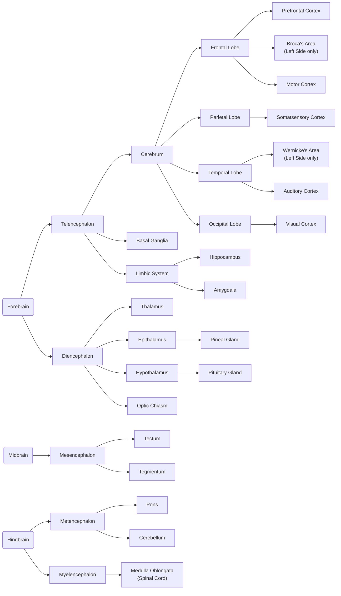
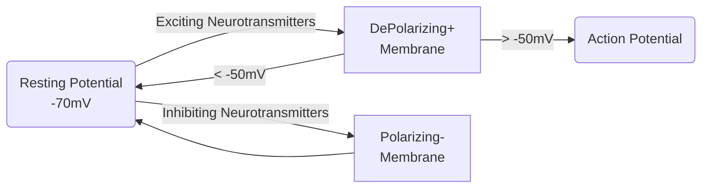

# Notes on Neuropsychology 101

## Disclaimers

* The [*Professor Dave Explains* Youtube playlists of "Biopsychology"](https://www.youtube.com/playlist?list=PLybg94GvOJ9EQp4lGx2kxTvA4Y7HUo5VY) and ["Anatomy and Physiology"](https://www.youtube.com/playlist?list=PLybg94GvOJ9HVbNobTmFnOxXRn1dIpffc), as well as the [*MIT Lectures of Nancy Kanweiser*](https://www.youtube.com/playlist?list=PLUl4u3cNGP60IKRN_pFptIBxeiMc0MCJP) have proven to be immensely useful resources for these notes.

## Anatomy of the Brain

### Brain structures and their functions

| Name                 | Functions                                                                                                                                                             | Brain Atlas                                                                     |
| -------------------- | --------------------------------------------------------------------------------------------------------------------------------------------------------------------- | ------------------------------------------------------------------------------- |
| Prefrontal Cortex    | Executive Functions:  - Working Memory  - Attention  - Decision Making  - Problem Solving  - Behaviour Inhibition  - Reasoning  - Empathy | [click](https://neurotorium.org/tool/brain-atlas/#prefrontal-cortex)            |
| Broca's Area         | Language Generation                                                                                                                                                   | [click](https://neurotorium.org/tool/brain-atlas/#broca%E2%80%99s-area)         |
| Motor Cortex         | Responsible for movement generation                                                                                                                                   | [click](https://neurotorium.org/tool/brain-atlas/#primary-motor-cortex)         |
| Somatosensory Cortex | Processes sensations - Sensation of touch - Haptic Feedback - Temperature  - Balance  - Pain                                                  | [click](https://neurotorium.org/tool/brain-atlas/#primary-somatosensory-cortex) |
| Auditory Cortex      | Accepts and encodes sound                                                                                                                                             | [click](https://neurotorium.org/tool/brain-atlas/#primary-auditory-cortex)      |
| Wernicke's Area      | Makes sense of language                                                                                                                                               | [click](https://neurotorium.org/tool/brain-atlas/#wernicke%E2%80%99s-area)      |
| Visual Cortex        | - Accepts and maps visual information - Recognizes Objects                                                                                                    | [click](https://neurotorium.org/tool/brain-atlas/#primary-visual-cortex)        |
| Hippocampus          | Plays a huge role in memory and spatial associations                                                                                                                  | [click](https://neurotorium.org/tool/brain-atlas/#hippocampus)                  |
| Amygdala             | Center of fear and "*Fight or Flight*" response                                                                                                                       | [click](https://neurotorium.org/tool/brain-atlas/#amygdala)                     |
| Pineal Gland         | Generates hormone melatonin, regulates sleep-cycle                                                                                                                    | [click](https://neurotorium.org/tool/brain-atlas/#pineal-gland)                 |
| Pituitary Gland      | Generates hormones for reflexes, sexual desire, digestion, "*Fight or Flight*"                                                                                        | [click](https://neurotorium.org/tool/brain-atlas/#pituitary-gland)              |
| Thalamus             | Dispatches information between the different parts of the brain                                                                                                       | [click](https://neurotorium.org/tool/brain-atlas/#thalamus)                     |
| Tectum               | Reflexes in response to auditory or visual stimuli                                                                                                                    |                                                                                 |
| Tegmentum            | Homeostasis, plays a role in pain relief                                                                                                                              |                                                                                 |
| Pons                 | - Passes messages from the Forebrain to Cerebellum - Plays a role in respiration                                                                              | [click](https://neurotorium.org/tool/brain-atlas/#pons)                         |
| Cerebellum           | - Balance - Body Posture - Motor coordination - Memory                                                                                                    | [click](https://neurotorium.org/tool/brain-atlas/#cerebellum)                   |
| Medulla Oblongata    | It is the last part of the brain before the Spinal Cord                                                                                                               | [click](https://neurotorium.org/tool/brain-atlas/#medulla-oblongata)            |

### Hemispheres, Lateralization and the *Corpus Callosum*

The brain, from Diencephalon and moving towards the Telencephalon, is organized in **2 Hemispheres**. The 2 Hemispheres are closely identical. This means that many brain parts exist in double, one residing in the Left Hemisphere (LH) and one in the Right (RH). Parts like the Amygdala, Hippocampus (of the Diencephalon), as well as the Cerebrum lobes (Frontal, Parietal, Temporal and Occipital), exist in double.

The brain functionalities are *lateralized*, meaning they are shared between the Hemispheres. Typically, the *Language Processing is lateralized to the Left Hemisphere*, with Broca's Area (Language Generation, located roughly behind the left eye) and Wernicke's Area (Language Comprehension, located roughly behind the left ear).

Additionally, *Body Control is mostly Laterilized*, with the RH controling the left parts of the body and the LH controling the right parts.

Finally, *Vision is Laterilized through the Optic Chiasm*, which is better explained under [*Visual System*](#visual-system).

The *Corpus Callosum* ([Brain Atlas link](https://neurotorium.org/tool/brain-atlas/#corpus-callosum)) *connects the two Hemispheres*. This enables the cross-functionality of the brain. E.g: Putting in words (LH functionality - Broca's Area) events of symbolic memory (RH functionality - Right Hippocamhpus).

Severing the Corpus Callosum, such as in old cases of Epileppsy, would create the "split-brain" effect, where the two Hemispheres do not communicate.

---

## Neural Firing

### The Neuron

The Neuron or Neural Cell, is the part of the brain that can be individually analyzed to lead us to the big picture. The *Central Nervous System* (CNS) contains more than 80 billion of them.

The Neuron is designed *to transfer information*. All its parts play a role in this functionality:

| Name             | Functionality                                                                                                                                                                                   |
| ---------------- | ----------------------------------------------------------------------------------------------------------------------------------------------------------------------------------------------- |
| Soma (Cell Body) | Contains the Nucleus (DNA, RNA) and the components of the Cell that keep it alive (Mitochondria, etc)                                                                                           |
| Cell Membrane    | It is the part that encloses the neuron, *selectively* isolating it from its surroundings, maintaining the *Resting Potential* and enabling its *Action Potential*.                             |
| Axon             | The long tail connecting the *Dendrites* to the *Axon Terminals*.  *Sometimes* it is surrounded by *Myelin Sheath* and split by *Nodes of Ranvier*.                                         |
| Axon Terminals   | Contain the Pre-Synaptic parts, that hold (and *reuptake*) the *Neurotransmitters* and release them to the *Synaptic clefts*. Serve as the *Output* of the Neuron.                              |
| Dendrites        | Contain the Post-Synaptic parts that receive *Neurotransmitters* through the *Synaptic clefts*. Serve as the *Input* of the Neuron.                                                             |
| Myelin Sheath    | Insulation of the Axon that vastly increases the speed of the travelling information (from the *Dendrites* to the *Axon Terminals*).                                                            |
| Nodes of Ranvier | They are responsible for the [*Saltatory Conduction*](#saltatory-conduction), a process that helps $Na^+$ Ions travel faster during the [*Action Potential*](#action-potential), saving energy. |

### Neuron Potentials

The move from *Resting* to *Action Potential* is what the Neurons are designed to do - their function. It is a chemical and electrical phenomenon, yet a very simple concept.

All moving parts will be explained below omitting as many intimidating details as possible (a more advanced take is available in this *Harvard Extension School* Video: [Action Potential in the Neuron - YouTube](https://www.youtube.com/watch?v=oa6rvUJlg7o) and greatly explained here: https://pressbooks.online.ucf.edu/lumenpsychology/chapter/reading-neural-communication/)

#### The Ions

Ions are the electrically charged counterparts of atoms. The ones we care about are:

| Symbol | Name     |
| ------ | -------- |
| $Na^+$ | Sodium   |
| $K^+$  | Potasium |
| $Ca^+$ | Calcium  |

#### The Electrical Urge

The Ions with different polarities (`+` and `-`) have the urge of coming close to each other. Generally, the *positive* Ions want to move to a more *negatively charged* place (place with more *negative* Ions) and vice-versa.

The more negatively (/positively) charged the place, the more the positive (/negative) Ions want to go there! This urge is measured in Volts ($V$).

#### Chemical Urge

All the Ions feel like moving to places that less of their kind exist. Much like *dye in a water glass will blend* (even without stirring), trying to reach homogeneity. *Homogenous* blends are the ones that if you take a teaspoon from them, it will be the same as any other teaspoon from the  same blend! In other words, $Na^+$ Ions, for example, don't want to be more in one place, and less in another. They want to spread equally.

These 2 *urges* can explain everything about *Action Potential*! And they form the things called *Chemical Gradient* and *Electrical Gradient* (the *google-able* terms).

### The *Resting Potential* of the Neuron

Neurons both *contain* and *are surrounded* by *Ions*. They contain some $K^+$ Ions and some *Proteins that are negatively charged*. By "contain" we mean that these things exist inside the *Cell Membrane*, and they are not allowed to go through it - without special circumstances.

Outside the *Membrane* there are ***a lot of*** $Na^+$ Ions and some $Ca^+$. This creates the following effects:

* There are plenty $Na^+$ Ions outside the *Membrane* and not nearly as many inside of it. This pumps up their *Chemical Urge* to move inside (until they are split equally in both sides).

* The Negative Proteins in the Neuron charge it overally negative, so $Na^+$ Ions want to move in the *Neuron Cell* due to their *Electrical Urge* as well.
  How much they want to move in? About $70mV$!

So, in the *Resting Potential* of the neuron, a voltage of about $70mV$ is measured between the two sides of the *Cell Membrane*. And without external events, this is balanced.

#### The Ion Gates

The Neuron Membrane has several kinds of structures that allow Ions to move through. They serve as Gates, conditionally allowing the entrance or exit. Analyzing all of them and their conditions is beyond the scope of the notes.

The most crucial to understand though is the $Na^+$ Gate. This one opens when the voltage difference of the Membrane reaches about $-50mV$. And if these Gates open, they can let the $Na^+$ Ions rush in!

Yet, there is this $20mV$ of difference, between the *Resting Potential* ($-70mV$) and the $Na^+$ Gate opening. This means that something needs to happen to the Neuron. Something that will add some positive charge to it. The word is *Excitation*!

#### Excitation and Inhibition

The Neurons are made to be connected. Their *Dendrites* and *Axon Terminals* are their plugs. The *Dendrites* are the *Inputs* and the *Terminals* are the *Outputs*. These two get connected when getting pretty close to each other. They come so close that what is between them is named a *Cleft*. The *Synaptic Cleft*.

##### Synapses and Neurotransmitters and Receptors

A Synapse is the space between the connected *Axon Terminal* (Output) of one Neuron with a *Dendrite* (Input) of another. The *Axon Terminal* (the *Presynaptic Membrane*) transmits information to the *Dendrite* by releasing substances called *Neurotransmitters*. These are received by the Dendrite (and its *Postsynaptic Membrane*) through some components, called *Receptors*.

The couple of *Neurotransmitter* and *Receptor* can then do one of two things:

* *Excite* the Membrane (charge it more positively)
  
  * Term: *Excitatory Post Synaptic Potential (EPSP)* 
  
  * Depolarize (Bring it closer to $0mV$)

* *Inhibit* the Membrane (charge it more negatively)
  
  * Term: *Inhibitory Post Synaptic Potential (IPSP)*
  
  * Polarize (Bring it even further from $0mV$)

Now, if the *Dendrite* *Receptors* receive enough Neurotransmitters that excite its Membrane for more than $-20mV$ then the Neuron will move from the *Resting Potential* to the *Action Potential*.

### The *Action Potential*

If an exciting *Neurotransmitter* is received in large enough quantity by enough of the Denrites of a Neuron, the Voltage of the Membrane will get higher than $-50mV$ (called the *Threshold*). And this is when the $Na^+$ Gates open in the Membrane! The $Na^+$ Ions flood inside the Neuron raising its Voltage to up to $+50mV$.

The $Na^+$ will rush through the Axon to the Axon Terminals, making that part of the Membrane allow $Ca^+$ Ions in (through some other Ion Gate). This is the signal for the *Axon Terminal* to release its own Neurotransmitters to the Dendrites of the next Neuron.

If they are enough (or if it receives Neurotransmitters by other Neurons connected to its other Dendrites at the same time), the *Action Potential* of the next Neuron will be triggered, cascading the message across!

#### Saltatory Conduction

This is a small hack that makes $Na^+$ Ions travel faster in the Neuron. The *Nodes of Ranvier* that run through the Axon are already full of $Na^+$ Ions! So the ones that flood the Neuron during the Action Potential, do not need to travel all the way through the Axon, just push the ones found in the *Nodes of Ranvier* towards the *Axon Terminal*!

It is like pumping water in a firehose that is already full of water. There is no need for the water to travel from the pump through the whole hose. The pumped water will push the water in the hose directly out and the effect will be close-to-immediate. It's the same but with $Na^+$ Ions instead of water!

### Types of Drugs

#### Agonists

Are the ones that can substitute a Neurotransmitter. Agonists can be received by Receptors, exciting or inhibiting the Neuron, exactly as a Neurotransmitter would do.

#### Antagonists

Are the ones that block the Receptors for specific Neurotransmitters. They get received by the Receptors but they neither excite or inhibit. They just take up space, so the expected Neurotransmitter won't be able to arrive to the Receptor.

#### Reuptake Inhibitors

The Presynaptic Membranes (in the Axon Terminals) sometimes "reuptake" Neurotransmitters released in the Synapse, saving the energy of recreating them, making them ready for the next firing.

This is hindered by Reuptake Inhibitors, leaving the Neurotransmitters longer in the *Synaptic Cleft*, allowing more time for the Receptors to consume them.

---

---

## Memory

---

## Language

---

## Neuro-Imaging

---

## 
