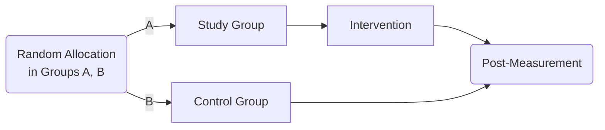
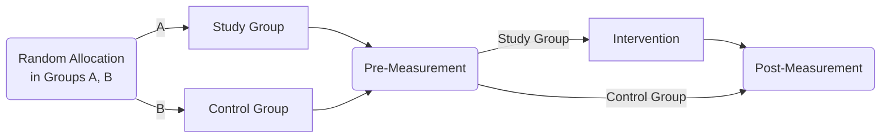
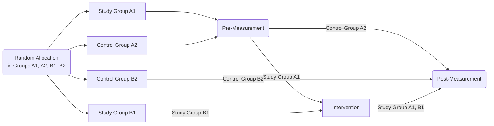
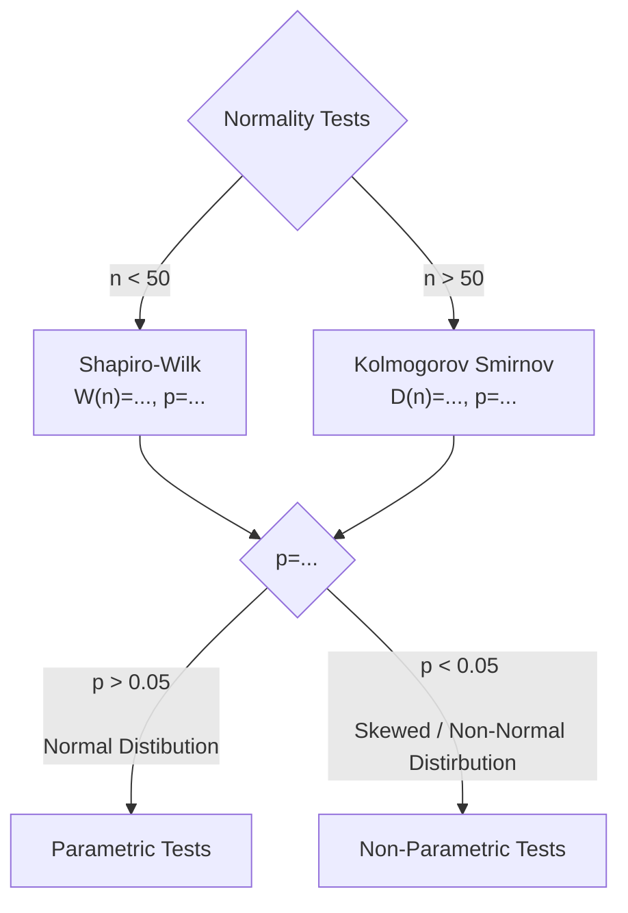
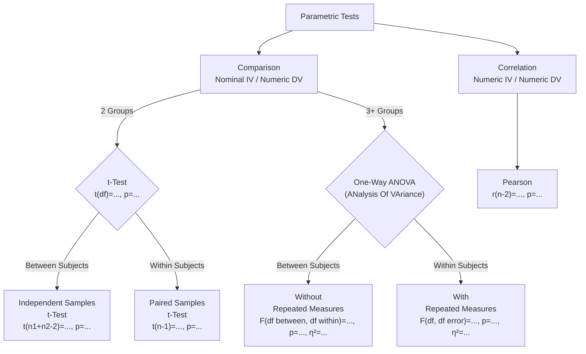
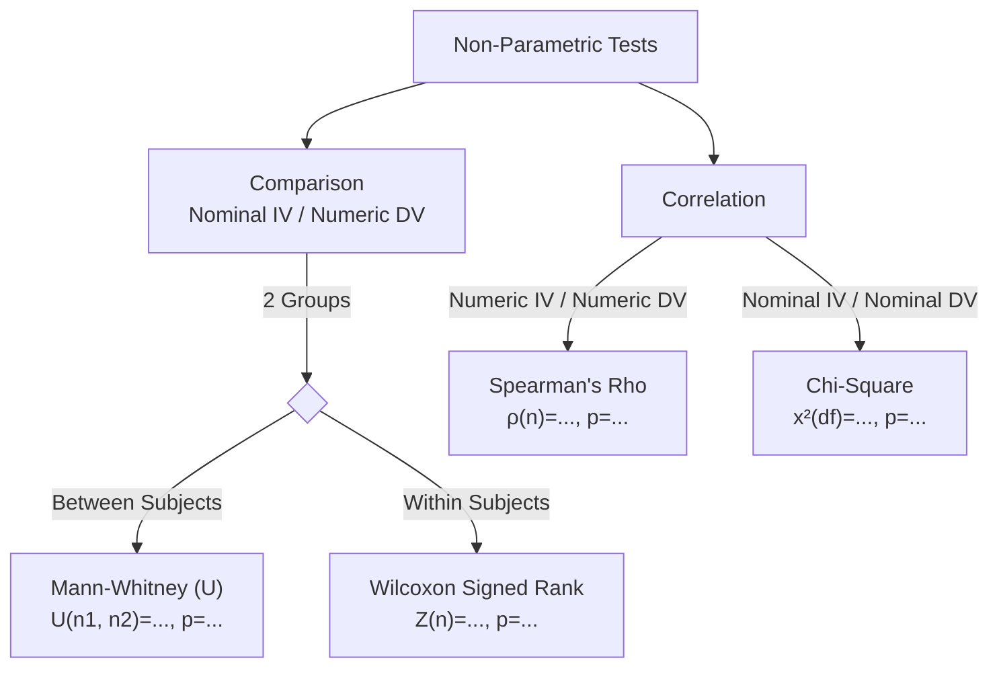

# Notes on Statistics 101

## Disclaimers

* For everything in these notes I have used [StatsKingdom](https://statskingdom.com), which is free and online (no installation needed) and self-explanatory. No SPSS used anywhere.

* $\int$ome math symbols might be used. Do not feel intimidated - you 'll get it. If you don't you probably don't need to!

* The notes are of a 101 course. A lot of Statistical Tests are not covered.

* The [*datatab* Youtube channel](https://www.youtube.com/@datatab) and [*SimplyPsychology* Website](https://www.simplypsychology.org) have proven to be very valuable resources for these notes.

---

## Variables

### Variable Scales

The way to interpret our data in a measurable and processable way using numbers.

There are 4 types (or scales) of variables. They are mutually exclusive, meaning that a variable can only be in one of the 4 types:

* Nominal

* Ordinal

* Interval

* Ratio

#### Nominal Scale

These variables are used to interpret *types of things*. Sex (as in [chromosomic sex](https://en.wikipedia.org/wiki/Sex_chromosome)), tree types (e.g: oak, maple, birch, etc) or even hobbies (e.g: skiing, sky-diving, etc). We map all the available values to whole numbers, traditionally starting from 0.

E.g: A Nominal variable for Sex

| Sex    | Variable |
| ------ | -------- |
| Male   | 0        |
| Female | 1        |
| Other  | 2        |

The numbers of the nominal scale have **no comparison value**. There is no meaning in saying "Female < Other" because 1< 2. We could very well use *any number for any value* in the table above.

#### Ordinal Scale

These variables are a lot like Nominal Scale, but with a main difference: they have comparative value. **The comparation between the values has meaning**. Typical examples of this variable type is *age groups*. Another very common example is the [Likert Scales](https://www.simplypsychology.org/likert-scale.html) (Questions with answers of: Very Often, Often, etc).

E.g: [Erikson's Psychosocial Stages in Developmental Psychology](https://www.simplypsychology.org/erik-erikson.html):

| Stage Name      | Age   | Variable |
| --------------- | ----- | -------- |
| Infancy         | 0-1   | 0        |
| Early Childhood | 1-3   | 1        |
| Play Age        | 3-6   | 2        |
| School Age      | 7-11  | 3        |
| Adolescence     | 12-18 | 4        |
| Early Adulthood | 19-29 | 5        |
| Middle Age      | 30-64 | 6        |
| Old Age         | 65+   | 7        |

In this example saying 1 < 2 has a meaning, it shows that the "*Early Childhood*" **comes before** "*Play Age*", when a person ages, which is true.

#### Interval Scale

This type of variable is used to interpret things measured in whole numbers.

Examples are Grades on a test or temperature in Celsius. This type of variable **can be ordered** (10°C < 20°C). Additionally, in this scale, zero is not treated as absence of the phenomenon. The value of 0°C doesn't mean that there is *no temperature*, but that the temperature is 0°C.

Additionally, in Interval Scale **multiplication does not have meaning**. There is no meaning in saying that 30°C is *three times* as hot as 10°C. This means that ratios do not have a meaning.

They are a thing in Ratio Scale.

#### Ratio Scale

The Ratio Scale is used for all continuous values that are not measured in the Interval Scale. Examples are Height, weight, time of perception in an experiment. Values of Variables in Ration Scale *can compare* and *multiplication* has meaning, as in 10 meters *are twice as long* as 5 meters. Also, zero means the abscence of the phenomenon - as 0grams means no weight.

#### Examples on the Scales

A small questionnaire gathering some facts on a person of a sample can look as bellow:

| Question # | Question            | Possible Answers                             | Variable Type |
| ---------- | ------------------- | -------------------------------------------- | ------------- |
| 1          | Age Group           | { `0`: 0-1, `1`: 1-3, ... }                  | Ordinal       |
| 2          | Sex                 | { `0`: Male, `1`: Female, `2`: Other }       | Nominal       |
| 3          | Continent of Origin | { `0`: Europe, `1`: Asia, `2`: Africa, ... } | Nominal       |
| 4          | IQ Measurement      | In [70, 130]                                 | Interval      |
| 5          | Height              | In cm                                        | Ratio         |

---

### Roles of Variables

Any study needs at least two variables. Basically, the study is the exploration of the relationship between them. So, variables are split in two fundamental categories, depending on what role they play in the study.

#### Independent Variables

These are the ones that the study can directly control. The study examines how *independent* changes to this variable can affect the *[Dependent Variable](#dependent-variables)*.

#### Dependent Variables

These are the variables that are measured and observed for changes. The study tries to find out whether and how much changes to this Variable *depend* on the changes of the *[Independent Variable](#independent-variables)*.

#### Examples on Variables

| Study Description                                                                                              | Independent Variable                                       | Dependent Variable                                    |
| -------------------------------------------------------------------------------------------------------------- | ---------------------------------------------------------- | ----------------------------------------------------- |
| Trying out different fertilizers to see how they affect the growth of a plant                                  | Fertilizer Types  ([Nominal](#nominal-scale))          | Plant Growth  ([Ratio](#ratio-scale))             |
| Testing how much the level of background noise (in 1-5 scale) affects the results on a 10-question memory game | Levels of Background Noise ([Ordinal](#ordinal-scale)) | Memory Game Results ([Interval](#interval-scale)) |
| Finding out which population is the highest out of 5 countries                                                 | Countries ([Nominal](#nominal-scale))                  | Height ([Ratio](#ratio-scale))                    |

---

## Descriptive Statistics

Given some data on a variable (e.g: the heights of all students in a class - *variable*: height, *sample*: class members), we can try and *describe* that data using some metrics.

Essentially, to describe the data of this example, we need two things, an estimation on the "whereabouts" of the heights (the *average* height of the class), and an estimation of how much the heights in the class vary.

The former are the [*Central Tendency Indicators*](#central-tendency-indicators), the later the [*Indicators of Variability*](#indicators-of-variability).

### Central Tendency Indicators

To describe the measures below, a sample of heights of students (in cm) will be used as follows:

| Std 1 | Std 2 | Std 3 | Std 4 | Std 5 | Std 6 | Std 7 |
| ----- | ----- | ----- | ----- | ----- | ----- | ----- |
| 1.64  | 1.82  | 1.69  | 1.55  | 1.74  | 1.62  | 1.70  |

#### Mean $\bar{x}$ - The Average

The Mean value is calculated by taking the sum of all the heights and then dividing it by the number of students.

In math language, if we name $x_i$ each student (e.g $x_1$: Std 1, $x_2$: Std 2, etc), and N the number of students (so N=7), the mean is:

$$
\bar{x} = \frac{x_1 + x_2 + x_3 + x_4 + x_5 + x_6 + x_7} {N}
$$

But, to avoid this huge addition line, we can also write (which means the same thing):

$$
\bar{x} = \frac{ \sum_{i=1}^{N} x_i }{N}
$$

And $\sum$ explains the addition. Finally, the symbol for *Mean* is always this $x$ with the line: $\bar{x}$ .

So:

$$
\bar{x} = 1.68
$$

#### Median $\tilde{x}$ - The Middle

The Median value is the one in the exact *center* of the sample. That's it. We get it by ordering the sample and getting the middle value:

| Std 4 | Std 6 | Std 1 | Std 3 | Std 7 | Std 5 | Std 2 |
| ----- | ----- | ----- | ----- | ----- | ----- | ----- |
| 1.55  | 1.62  | 1.64  | 1.69  | 1.70  | 1.74  | 1.82  |

The Median is the height of *Std 3*. So:

$$
\tilde{x} = 1.69
$$

#### Mode $M_O$ - The $M_O$st

The above measurements work with Numerical Variables, but not with Nominal and Ordinal ones. We *cannot* get the Mean and Median of Chromosomic Sex, or smokers of tobaccco, electronic cigarettes and non-smokers.

The sexes of the students are used as an example:

| Std 1 | Std 2 | Std 3  | Std 4  | Std 5 | Std 6 | Std 7 |
| ----- | ----- | ------ | ------ | ----- | ----- | ----- |
| Male  | Male  | Female | Female | Male  | Other | Male  |

To find the Mode, we just count all student sexes:

| Sex    | Frequency |
| ------ | --------- |
| Male   | 4         |
| Female | 3         |
| Other  | 1         |

The Mode is the value of the highest frequency:

$$
M_O = Male
$$

In case of a tie, all values of highest frequency are Modes.

### Indicators of Variability

Having the Central values, we need a way to explain how much our data spread around this value. This is called variability.

#### Range - $Max - Min$

Taking the same example of heights, *Range* is calculated by getting the two outmost values and subtracting them.

In this Example, Std 4 is the shortest (1.55) and Std 2 is the tallest (1.82). So the Range (with symbol $L$) is:

$$
L=1.82-1.55 = 0.27
$$

This, effectively shows that there is no bigger height difference in the group than 0.27 cm.

#### Standard Deviation

This is a bit tricky, but very useful thing. Calculating involves squares, square roots and sums so don't bother. Good thing that SPSS and [statskingdom](statskingdom.com) just calculate it by themselves, when using *Descriptive Statistics*. The whole formula is here, but *feel free to not get it*:

$$
SD = \sqrt{ \frac{\sum_{i=1}^{N}{(\bar{x}-x_i)^2}}{N-1} }
$$

This value could express something close to the Mean distance of each value to the $\bar{x}$ itself. It is a useful indicator of *Normal Distribution*, which is what determines whether we use [*Parametric* or *Non-Parametric Statistical Tests*](#normality-tests).

---

## Quantitive Research Question

### Description

Such researh questions have the purpose to describe a phenomenon, not to examine a relationship between variables, hence only one variable is needed.

To explain Descriptive Research, let's take the example question: "*How much of the general population has ADHD?*"

To go about this research, we first need an inventory to measure ADHD, providing us data, probably in a Scale or *Interval Scale Variable*. Then we take a *sample in a way that can be generalized* from the general population, apply our inventory and get data. Then we calculate the [Descriptive Statistics](#descriptive-statistics) (explained above) to the data and we are done!

Most research in Statistics 101 fall under the next two categories though, requiring a bit more complexity.

### Comparison

These research questions are about changes on a phenomenon given different discrete circumstances. They are about comparing 2 or more cases that have a specific difference.

An example research question could be: "*Does smoking cause higher cognitive functioning?*"

This research can be conducted by taking two groups of people, the non-smokers (Control Group) and the smokers (Study Group), forming a 2-value *Nominal Scale Independent Variable*. Then use a cognitive challenge on all participants and note their scores, forming an *Interval Scale Dependent Variable*. Finally, check whether there was a *Significant* difference in the scores of the groups using a *Statistical Test*.

### Correlation

These research questions are about examining whether change to one factor (Predicting Factor) can predict changes to other factors (Criterion Factors). These are the equivalent names of *Independent* and *Dependent Variables* in Correlation research.

An example research question could be: "*Can studying hours predict the score of a neuropsychology exam?*"

We could conduct this research by getting pairs of values for the two variables: study hours  (Interval Scale Predicting Factor) and exam scores (Interval Scale Criterion Factor). Then use a Statistical Test for examining the correlation between the two variables, determining the *Statistical Significance* and the *Correlation Coefficient*.

---

## Hypothesis Testing

The research question is generated by a hypothesis. A hypothesis is a sentence that can be either True or False and emerges from the research question.

To break down this example research, the Hypothesis is "If I talk nicely to a plant, it will grow faster than a normal plant".

The research for this could be conducted by a [*Comparison Research Question*](#comparison), where two plants (or plant groups) would be used ([*Nominal Scale*](#nominal-scale) [*Independent*](#independent-variables) Variable). One plant that someone will talk to (Study Group) and one that will be left to grow alone (Control Group). The growth of the plant is measured giving us a [*Ratio Scale*](#ratio-scale) [*Dependent*](#dependent-variables) Variable.

### Null Hypothesis - $H_0$

The Null Hypothesis is the one that is True if there is absolutely no effect to the Dependent Variable. In the above example, the Null Hypothesis is: "*There is no effect to the growth of a plant regardless of talking to it or not*". This is the Hypothesis that we want to disavow by doing our research.

### Alternative Hypothesis - $H_1$

This is the Hypothesis of the research. The: "*If I talk nicely to a plant, it will grow faster than a normal plant*" is an Alternative Hypothesis. It has to be stated in a study's Abstract and Introduction, and can be either One-Tailed or Two-Tailed, depending on its "direction".

#### One-Tailed Hypothesis

This Hypothesis has a single direction of expected outcome. For example, the "*If I talk nicely to a plant, it will grow faster than a normal plant*" Hypothesis is One-Tailed, as it assumes that talking to a plant can *only* make it grow *faster*. If the plant grew slower, we would need a different Hypothesis (and research) to check it, which would be: "*If I talk nicely to a plant, it will grow **slower** than a normal plant*".

#### Two-Tailed Hypothesis

The Two-Tailed Hypothesis solves this issue. To convert the example Hypothesis into a Two-Tailed one, we could re-write it us: *If I talk nicely to a plant, it will grow **differently** than a normal plant*".

---

## Experimental Designs

This explains how a research sample can used to conduct a research.

### Between Subjects

The Between Subjects Designs are about comparing groups of *different* subjects against each other. The common part is that all subjects of a sample are split into groups using randomness, and that they don't differ significantly in specific ways.

#### Single Post-Measurement

The problem with this design is that we cannot be sure that the two groups had no significant differences before the Intervention.

This is solved with *Pre-Measurement*.

#### Pre-Measurement

With this design we can compare the Pre- and Post-Measurements to spot the individual changes that *Intevention* could have in subjects. Later the Measurement differences can be compared between the 2 groups.

Yet, this design creates the problem of *Familiarization*. Which happens if the measurement is a questionnaire or some task that can be memorized by the subjects. In that case the Post-Measurement can be higher as the subjects have come across the questionnaire again (in the Pre-Measurement).

This is controlled by the *Solomon Four Group Design*. Which is basically a mix of the above two Designs.

#### Solomon Four Group Design

Using this Design we can also measure how much the *Familiarization* affects the measurements, as we have both Control and Study groups that have and have-not been through the "familiarizing" Pre-Measurement.

### Within Subjects

These designs are about exposing *the same* sample to all the values of the *Independent Variable*. This is useful as it counterbalances the individual differences introduced by groups in Between Subject Designs.

---

## Statistical Tests

Some flowcharts I use to understand when to use each test. The following Statistical Tests are covered:

| Statistical Test                                | APA Style Reporting                               | What is the Test about? | Parametric |
| ----------------------------------------------- | ------------------------------------------------- | ----------------------- | ---------- |
| Shapiro-Wilk                                    | $W(n)=..., p=...$                                 | Normality               | -          |
| Kolmogorov Smirnov                              | $D(n)=..., p=...$                                 | Normality               | -          |
| t-Test Independent Samples                  | $t(n1+n2-2)=..., p=...$                           | Comparison              | Yes        |
| Mann-Whitney (U)                                | $U(n1, n2)=..., p=...$                            | Comparison              | No         |
| t-Test Paired Samples                       | $t(n-1)=..., p=...$                               | Comparison              | Yes        |
| Wilcoxon Signed Rank                            | $Z(n)=..., p=...$                                 | Comparison              | No         |
| One-Way Anova Without Repeated Measures | $F(df_{between}, df_{within})=..., p=..., η²=...$ | Comparison              | Yes        |
| One-Way Anova With Repeated Measures    | $F(df, df_{error})=..., p=..., η²=...$            | Comparison              | Yes        |
| Pearson r                                       | $r(n-2)=..., p=...$                               | Correlation             | Yes        |
| Spearman Rho                                    | $ρ(n)=..., p=...$                                 | Correlation             | No         |
| Chi-Square                                      | $x²(df)=..., p=...$                               | Correlation             | No         |

### Normality Tests

These tests are used data of a Numeric Variable (*Interval* and *Ratio Scales*) to test whether they fall under the Normal Distribution.

#### The Normal Distribution

The Normal Distribution is a way that data spread across their Mean ($\bar{x}$) that provide some guarantees that are very useful in statistics. Specifically:

* The Mean, Mode and Median are all approximately equal

* The ~68% of the sample falls under $±1 * SD$ around the Mean ($\bar{x}$)

* The ~95% of the sample falls under $±2 * SD$ around the Mean ($\bar{x}$)

* The ~99.7% of the sample falls under $±3 * SD$ around the Mean ($\bar{x}$)

In the above illustration Mean is symbolized as μ and Standard Deviation as σ.

The catch is that, ***only if*** the data of a variable is Normally Distributed, we can use *Parametric Statistical Tests* with it.

If the data is skewed or non-normal in any way, ***only*** *Non-Parametric Tests* can be used with it.

#### Chart

### Parametric Tests

### Non-Parametric Tests

